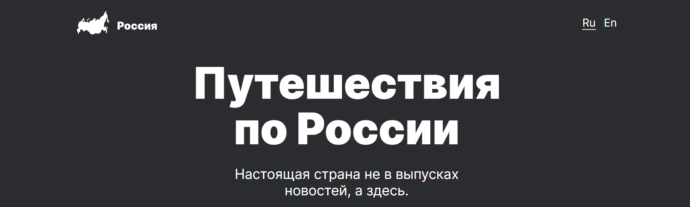
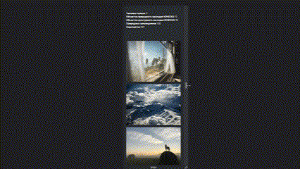

# Проект: Путешествие по России

Это информационная страничка с полезной информацией о путешествиях по России, который содержит множество материалов по теме и ссылок на полезные сайты.

## Макет

Работа выполнена по [макету Figma](https://www.figma.com/file/5S2WSbEFL6awjVWJ0NWL8Q/Sprint-3_-Russia-_-desktop-mobile?node-id=28503%3A0).

## Ссылка на сайт

Посмотреть на результат можно [здесь](https://frantsuzovatamara.github.io/russian-travel/).

## Что использовалось?

* HTML
* CSS
* Методология БЭМ
* Адаптивная вёрстка
* Flex и grid

## Доработка

* Добавить возможность смены языка
* Новый контент о путешествиях
* Добавить больше интерактива